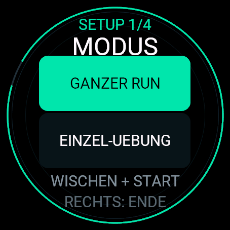
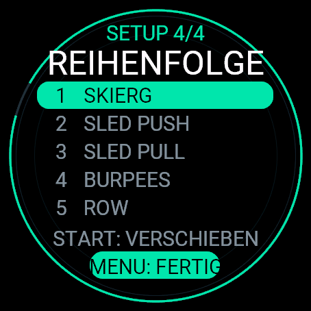
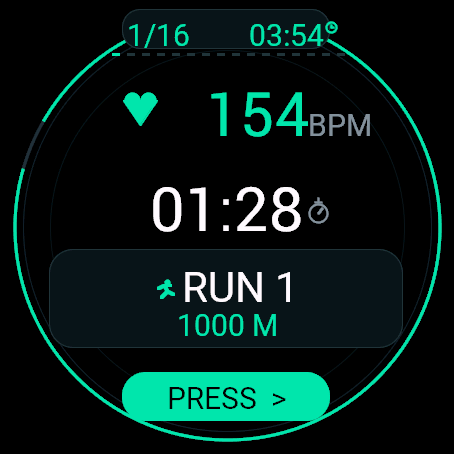
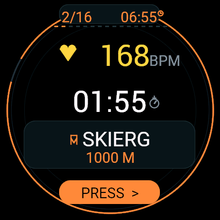
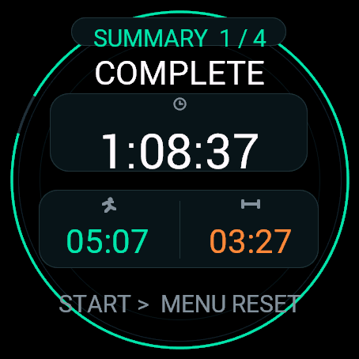
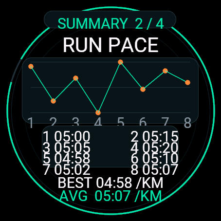

# Race Circuit for Garmin Venu 3

An independent, configurable race-training companion for a common eight-run,
eight-station fitness-race format. It can also time a single workout station.

This project is unaffiliated with and not endorsed by any race organizer or
fitness brand. Product and company names are intentionally omitted from the app.

## Screenshots

<p align="center">
  
  
  
</p>

<p align="center">
  
  
  
</p>

<p align="center"><sub>Garmin Venu 3 simulator in English. The two statistics screens use mock workout data.</sub></p>

## Features

- Full race or single-station mode
- First-launch language selection: English, German, or French
- Women/Men and Open/Pro load presets
- 25%, 50%, or 100% distance and repetition scaling
- Freely reorderable workout stations
- Current segment, segment time, total time, and progress
- Large, color-coded live heart-rate display
- Division-specific loads and scaled distances/repetitions
- Vibration feedback for heart-rate thresholds and segment changes
- Undo protection for accidental segment changes
- Post-session timing summary
- Exit by swiping right before a session starts

Distances are timed from manual segment changes, so the app also works indoors
without reliable GPS. The app does not record a FIT activity and does not persist
session results.

## Controls

- First setup step: choose English, German, or French
- Swipe in setup: change selection
- Start key: confirm a selection
- Start key on the order screen: enter or leave move mode
- Swipe in move mode: move the selected station
- Menu key on the order screen: finish setup
- Swipe right before starting: exit the app
- Start key during training: start or advance to the next segment
- Back key twice within two seconds during training: undo one segment
- Menu key after finishing: reset the session

## Requirements

- Garmin Connect IQ SDK Manager with the Venu 3 device package
- Java runtime supported by the installed Connect IQ SDK
- A local Connect IQ developer key

## Build

```powershell
.\build.ps1
```

The developer key is generated locally when needed and is excluded from Git.
The resulting `bin/RaceCircuit.prg` file is also excluded from Git.

## Release downloads

Publishing a GitHub Release automatically builds `RaceCircuit-Venu3.prg` and
attaches it to that release together with a SHA-256 checksum. Before publishing
the first release, add these repository secrets under **Settings > Secrets and
variables > Actions**:

- `GARMIN_USERNAME`: Garmin account used by the Connect IQ SDK Manager
- `GARMIN_PASSWORD`: password for that Garmin account
- `CONNECTIQ_DEVELOPER_KEY_BASE64`: optional but recommended Base64-encoded
  `developer_key.der`; using the same key allows future builds to update the app

To encode the existing developer key in PowerShell without changing the file:

```powershell
[Convert]::ToBase64String([IO.File]::ReadAllBytes("developer_key.der"))
```

Create a release from **Releases > Draft a new release**. Once it is published,
the workflow builds the tagged source and adds the installable PRG to the
release's **Assets** section. A failed build can be rerun from the Actions page;
the workflow can also be started manually for an existing release tag.

## Install on a Venu 3

Connect the watch by USB and copy the local `bin/RaceCircuit.prg` or downloaded
`RaceCircuit-Venu3.prg` to `Internal Storage/GARMIN/Apps`.

## Privacy

The app has no network integration, account system, analytics, or embedded user
identity. It reads live heart-rate sensor data only while the app is open.
